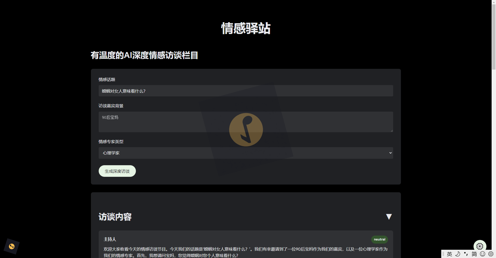
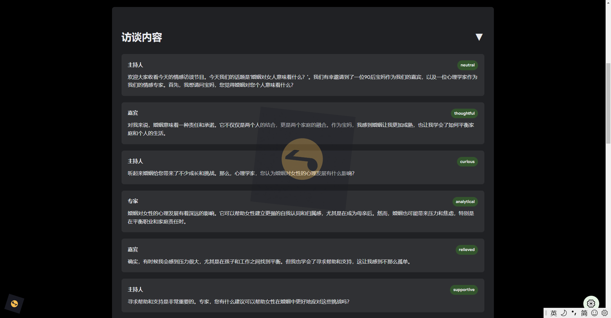
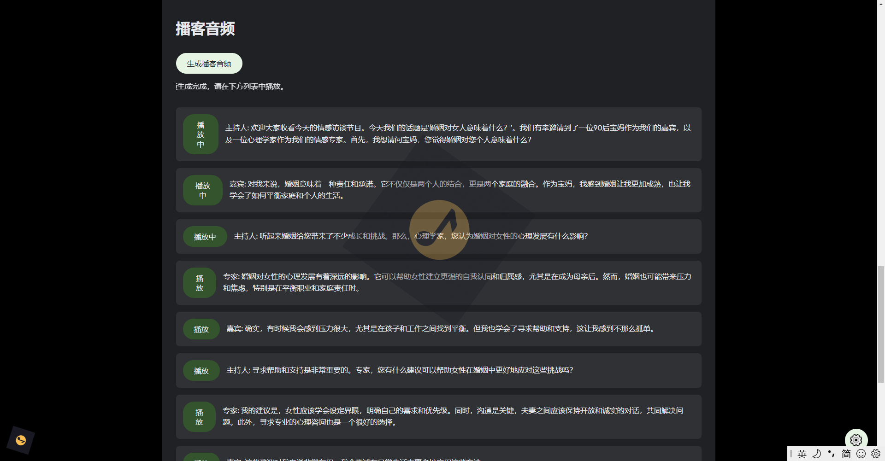
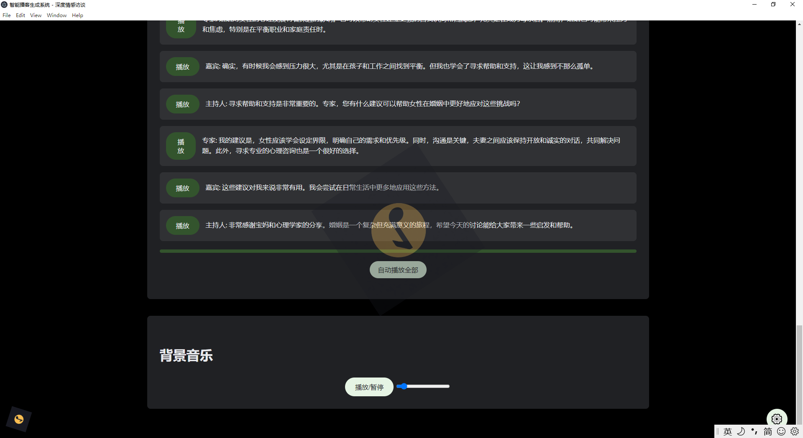
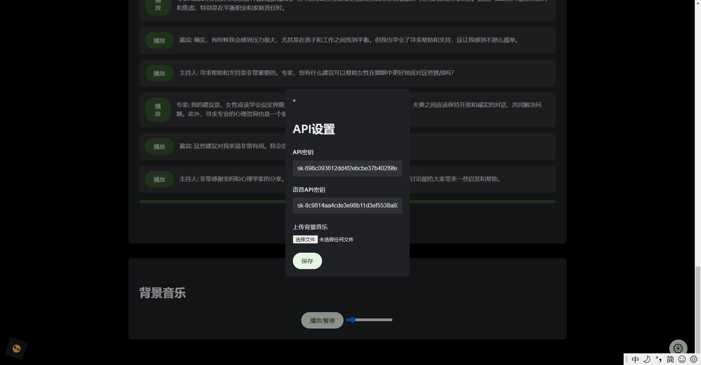

# NotebookLLM-Chinese
这是一个由AI生成的基于Electron的跨平台的中文版NoteBookLM，该应用可以使用LLM生成具有深度的访谈对话文本，同时基于
文本可以继续生成富有情感的语音，访谈预设三个角色【嘉宾、主持人、专家】，访谈的形式是嘉宾提出问题或者主题
主持人负责采访和深挖主题，专家负责解读访谈的内容，升华内容。

# 应用界面
## 设置主题和嘉宾背景


## 访谈内容


## 生成音频


## 音频播放


## 设置API KEY和背景音乐


# 小白入门
直接下载：Releases v1.1.0-bata
https://github.com/dubeno/NotebookLLM-Chinese/releases/download/v1.1.0-bata/my-electron-app-win32-x64-boke.zip
配置方式，参考B站视频内有说明：
https://www.bilibili.com/video/BV1bJ2YYwE27/?vd_source=44e03001713390fdf7b8b166f2d8d72b

# 程序开发
npm install 安装依赖
本地运行: 
    npm start
导出windows exe: 
    npm run build
    
# 开发密钥设置

需要设置APIkey 和角色配置，目前使用本人共享密钥，额度用完就无法使用，需要自己申请密钥

# 申请DeepSeek大模型API密钥
website: https://platform.deepseek.com/api_keys

# 申请睿声API密钥
website: https://dash.reecho.cn/apiKey

# 创建音频角色
## 1. 上传音频添加声音角色


## 2. 角色详情拿到角色标识


## 3. 角色标识配置在boke-google.html
```
const voiceIds = {
'主持人': '1d041342-e6b7-41f3-8f3f-xx',
'嘉宾': 'fe67f6a7-e6f8-4aa2-a8be-xx',
'专家': '3a501dda-b2f9-42fe-be08-xx'
};
```

问题排除：
3000端口的进程未杀死，无法二次启动，待修复的BUG

首先，使用 netstat -ano | findstr "3000" 来查找使用特定端口的进程。
然后，使用 taskkill /PID 进程ID /F 来结束该进程。

@联系作者，wechat:ppoluo